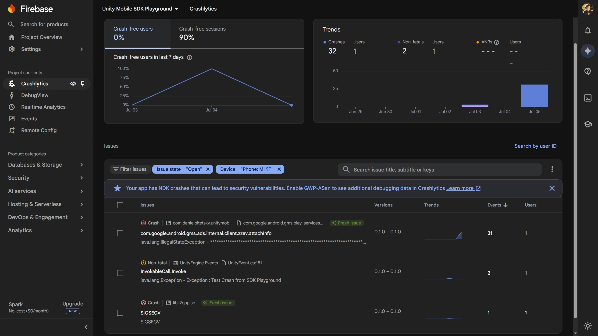
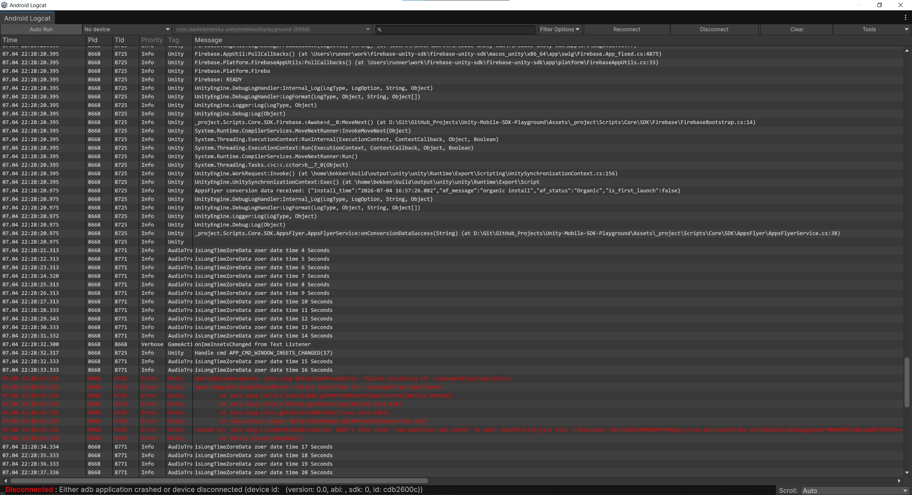

# Unity Mobile SDK Playground

[](https://unity.com/)
[](LICENSE)

Демонстрационный проект для интеграции и тестирования мобильных SDK в Unity-приложении. Включает работу с аналитикой, рекламой, crash-репортами и remote-конфигами.

## Интегрированные SDK

| SDK | Назначение | Версия |
|-----|------------|--------|
| **Firebase** | Аналитика, Crashlytics, Remote Config | 11.x |
| **AppsFlyer** | Mobile attribution & analytics | 6.17.6 |
| **Google AdMob** | Показ рекламы (баннер, интерстишал, rewarded) | 9.x |

> ⚠️ **Важно:** Для тестирования рекламы на реальном устройстве необходимо добавить свой `TestDeviceId` в `AdsService.cs` (строка с `TestDeviceIds`). Текущий ID принадлежит устройству разработчика и не будет работать на других телефонах.

---

## Возможности

- **Firebase**:
  - Отправка аналитических событий (LogLevelStart, LogPurchase)
  - Тестовый краш через Crashlytics
  - Получение и отображение Remote Config значений

- **AppsFlyer**:
  - Отслеживание событий Login, Purchase, Level Complete
  - Обработка conversion data

- **Google AdMob**:
  - Баннерная реклама (показ по кнопке)
  - Межстраничная реклама (Interstitial)
  - Вознаграждаемая реклама (Rewarded)

- **UI-статусы**:
  - Визуальное отображение готовности каждого SDK (зелёный/красный)

---

## Требования

- Unity 6000.5.2f1 или новее
- Android SDK (API Level 30+)
- iOS (опционально)
- Активный интернет для работы SDK

---

## Структура проекта

```
Assets/
├── _project/
│   ├── Scripts/
│   │   ├── Core/
│   │   │   ├── SDK/
│   │   │   │   ├── Ads/              # AdMob интеграция
│   │   │   │   │   ├── AdsBootstrap.cs
│   │   │   │   │   ├── AdsService.cs
│   │   │   │   │   ├── BannerAdService.cs
│   │   │   │   │   ├── InterstitialAdService.cs
│   │   │   │   │   └── RewardedAdService.cs
│   │   │   │   ├── Firebase/         # Firebase интеграция
│   │   │   │   └── AppsFlyer/        # AppsFlyer интеграция
│   │   │   └── UnityMainThreadDispatcher.cs
│   │   └── UI/
│   │       └── SDKStatusView.cs      # Отображение статусов
│   └── Scenes/
│       └── MainScene.unity
├── AppsFlyer/                         # Плагин AppsFlyer
├── Firebase/                          # Плагин Firebase
└── GoogleMobileAds/                   # Плагин Google Mobile Ads
```

---

## Управление

Интерфейс приложения предоставляет следующие кнопки:

### Firebase
- `Log Level Start` — отправка события начала уровня
- `Log Purchase` — отправка события покупки
- `Test Crash` — принудительный краш для теста Crashlytics
- `Fetch Remote Config` — загрузка конфигурации
- `Show Remote Config` — отображение значения `enemy_hp`

### AppsFlyer
- `Log Login` — событие входа
- `Log Purchase` — событие покупки
- `Log Level Complete` — событие завершения уровня

### Google Ads
- `Show Banner` — показ баннера
- `Hide Banner` — скрытие баннера
- `Show Interstitial` — показ межстраничной рекламы
- `Show Rewarded` — показ вознаграждаемой рекламы

---

## Настройка

### 1. Клонирование репозитория
```bash
git clone https://github.com/BlizzardDragon/Unity-Mobile-SDK-Playground.git
```

### 2. Открытие в Unity
Откройте проект в Unity 6000.5.2f1.

### 3. Настройка SDK
Для корректной работы SDK необходимо добавить свои ключи:

**Firebase:**
- Скачайте `google-services.json` из консоли Firebase и поместите в `Assets/Plugins/Android/`

**AppsFlyer:**
- В `AppsFlyerService.cs` укажите свои `devKey` и `appId`

**Google AdMob:**
- В `Assets/GoogleMobileAds/Settings/` укажите свой `Application ID`
- Замените тестовые Ad Unit ID на свои в файлах сервисов рекламы

### 4. Разрешение зависимостей
```bash
Assets → External Dependency Manager → Android Resolver → Force Resolve
```

---

## Скриншоты

### Главный экран приложения


### Firebase Events


### Firebase DebugView


### Crashlytics


### Firebase Remote Config


### Appsflyer Events


### Логи LogCat


---

## Решение проблем

### "No fill" при загрузке рекламы
- Убедитесь, что ваше устройство добавлено в `TestDeviceIds`
- Проверьте интернет-соединение
- Используйте тестовые Ad Unit ID для отладки

---

## Лицензия

MIT License — используйте свободно для обучения и тестирования.

---

## Контрибьюция

PR и issues приветствуются! Если нашли баг или хотите добавить новый SDK — создавайте issue.

---

## Контакты

- **Автор:** Daniil Pitetsky
- **GitHub:** [BlizzardDragon](https://github.com/BlizzardDragon)

---

*Проект создан в образовательных целях для демонстрации интеграции мобильных SDK в Unity.*